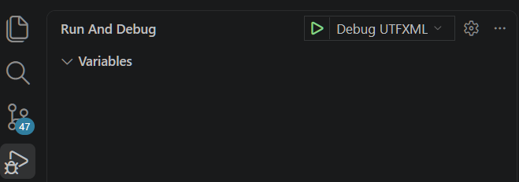

✨Dvurechensky✨

<h1 align="center">🐟 UTF to XML Converter 🐟</h1>

    
    
    
    

    

  <strong>🌐 Language: </strong>
  
  <a href="./README.ru.md" style="color: #F5F752; margin: 0 10px;">
    🇷🇺 Russian
  </a>
  | 
  
    ✅ 🇺🇸 English (current)
  

---

> [!NOTE]
> This project is part of the **Lizerium** ecosystem and belongs to the direction:
>
> - [`Lizerium.Tools.Structs`](https://github.com/Lizerium/Lizerium.Tools.Structs)
>
> If you are looking for related engineering and utility tools, start there.

## Credits

> [!NOTE]
> This project is based on work from the Freelancer community.  
> Reworked and integrated into the Lizerium ecosystem.
>
> by Sir Lancelot (a.k.a. Sirlancelot, Elvviis, Yud, vEct0r)
> Based on work by [`Jason Hood (adoxa)`](https://adoxa.altervista.org/freelancer/index.html)
> Full list [authors](CREDITS.md)

---

## My Version

> [!TIP]
> This is a `custom, reworked version` created for my own specific needs. However, you can find the list of changes in the [CHANGELOG](CHANGELOG.md).

---

## Run Debug

- Visual Code (Click play)

---

## Project Purpose

> [!NOTE]
> This tool was created for the project:
> [`Lizerium.DataValidation.Framework`](https://github.com/Lizerium/Lizerium.DataValidation.Framework)

Goals:

- Full validation of game assets
- Detection of **all possible errors**
- Compatibility with **all mod variations** of `Freelancer 2003`

---

## Description

`UTFXML.exe` is a tool for:

- unpacking `.cmp`, `.3db`, `.mat`, `.txm`
- converting them into `XML`
- extracting embedded resources (`.wav`, `.tga`, `.dds`, etc.)

---

## Features

| Feature         | Description                                                            |
| --------------- | ---------------------------------------------------------------------- |
| Extraction      | Extracts `UTF` file structure into `XML`, including embedded resources |
| Editing         | Full control via any text editor                                       |
| Rebuild         | Build XML back into `.cmp`, `.mat`, `.txm`                             |
| Named Hashes    | Supports `hash="gcs_refer_fc_new_short"` → auto ID resolution          |
| Transformations | RGB → HEX, quaternions → axis-angle, radians → degrees                 |
| Batch Mode      | Process multiple files from a directory                                |

---

## Notes

> [!TIP]
> Can be used as a **model structure analyzer**, not just a converter.

> [!WARNING]
> Some formats are **not fully tested yet**.

---

## Build

### Visual Studio 2022 && Visual Code

> It is important that `Visual Studio 2022` and its `Developer Command Prompt for VS 2022` component are present on the system.

1. Open `Visual Code` -> `Terminal`
2. [`Build`](build.bat)

### Visual Studio 2008

> [!IMPORTANT]
> Uses an old toolchain for maximum compatibility.

- **IDE:** Visual Studio `2008`
- Configuration: `Release`

Steps:

1. Open the project
2. Build
3. Done

---

## Related Directions

This layer is connected with:

- [`Lizerium.DataValidation.Framework`](https://github.com/Lizerium/Lizerium.DataValidation.Framework)
- [`LizeriumXMLtoUTF`](https://github.com/Lizerium/LizeriumXMLtoUTF)
