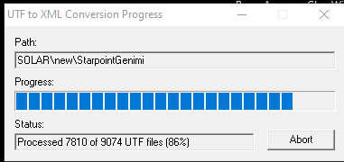

✨Dvurechensky✨

<h1 align="center">🐟 UTF to XML Converter 🐟</h1>

    
    
    
    

    

  <strong>🌐 Язык: </strong>
  
  
    ✅ 🇷🇺 Русский (текущий)
  
  | 
  <a href="./README.md" style="color: #0891b2; margin: 0 10px;">
    🇺🇸 English
  </a>

---

> [!NOTE]
> Этот проект является частью экосистемы **Lizerium** и относится к направлению:
>
> - [`Lizerium.Tools.Structs`](https://github.com/Lizerium/Lizerium.Tools.Structs)
>
> Если вы ищете связанные инженерные и вспомогательные инструменты, начните оттуда.

## ⚠️ Признательность

> [!NOTE]
> Этот проект основан на работе сообщества фрилансеров.
> Переработан и интегрирован в экосистему Lizerium.
>
> На основе работы [`Jason Hood (adoxa)`](https://adoxa.altervista.org/freelancer/index.html)

## 🐉 Важно

> [!IMPORTANT]
> Я **в курсе**, что оригинальный инструмент был создан ~15 лет назад (2010).
> Автор — **Jason Hood (Adoxa)**, первоначальная версия — **Sir Lancelot**.

---

## 🐬 Моя версия

> [!TIP]
> Это **кастомная переработка**, созданная под мои задачи.

- Добавлен вывод блока `Animation` → `XML`
- Проверено на `.cmp`
- Поддержка других форматов — **потенциально есть**, но требует тестирования

---

## 🐆 Назначение проекта

> [!NOTE]
> Инструмент создавался для проекта [`Lizerium.DataValidation.Framework`](https://github.com/Lizerium/Lizerium.DataValidation.Framework)

Цель:

- Полная проверка игровых ресурсов
- Поиск **всевозможных ошибок**
- Совместимость со **всеми модами** для `Freelancer 2003`

---

## 🌱 Описание

`UTFXML.exe` — инструмент для:

- распаковки `.cmp, .3db, .mat, .txm`
- конвертации в `XML`
- извлечения вложенных ресурсов (`.wav`, `.tga`, `.dds` и др.)

---

## ⚙️ Возможности

| Функция             | Описание                                                           |
| ------------------- | ------------------------------------------------------------------ |
| 📦 Распаковка       | Извлекает структуру `UTF`-файла в `XML`, включая вложенные ресурсы |
| ✏️ Редактирование   | Полный контроль через любой текстовый редактор                     |
| 🔄 Обратная сборка  | Сборка XML обратно в `.cmp`, `.mat`, `.txm`                        |
| 🔑 Именованные хеши | Поддержка `hash="gcs_refer_fc_new_short"` → автоматический ID      |
| 🔬 Преобразования   | RGB → HEX, кватернионы → ось+угол, радианы → градусы               |
| ⚡ Batch-режим      | Массовая обработка файлов из директории                            |

---

## 🧠 Особенности

> [!TIP]
> Можно использовать как **анализатор структуры моделей**, а не только конвертер

> [!WARNING]
> Поддержка некоторых форматов **не протестирована полностью**

---

## 🛠 Сборка

> [!IMPORTANT]
> Используется старый toolchain для полной совместимости

- **IDE:** Visual Studio `2008`
- Режим: `Release`
- Действия:
  - открыть проект
  - собрать
  - готово

---

🐟 Сделано для глубокого реверса и контроля данных 🐟

---

## Связь с другими направлениями

Данный слой связан с:

- [`Lizerium.DataValidation.Framework`](https://github.com/Lizerium/Lizerium.DataValidation.Framework)
